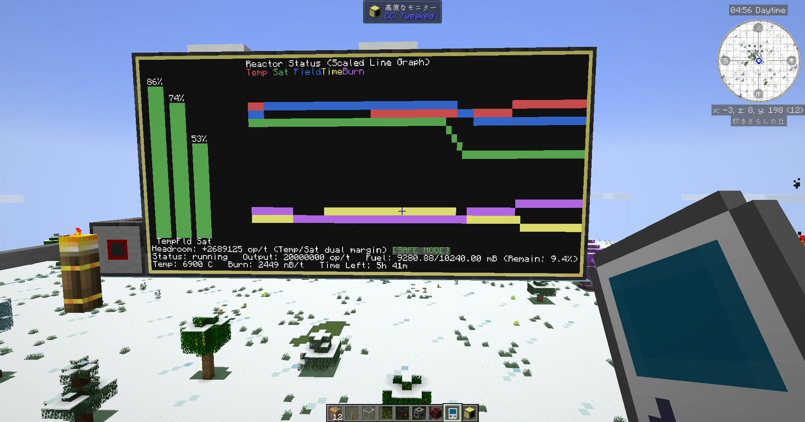
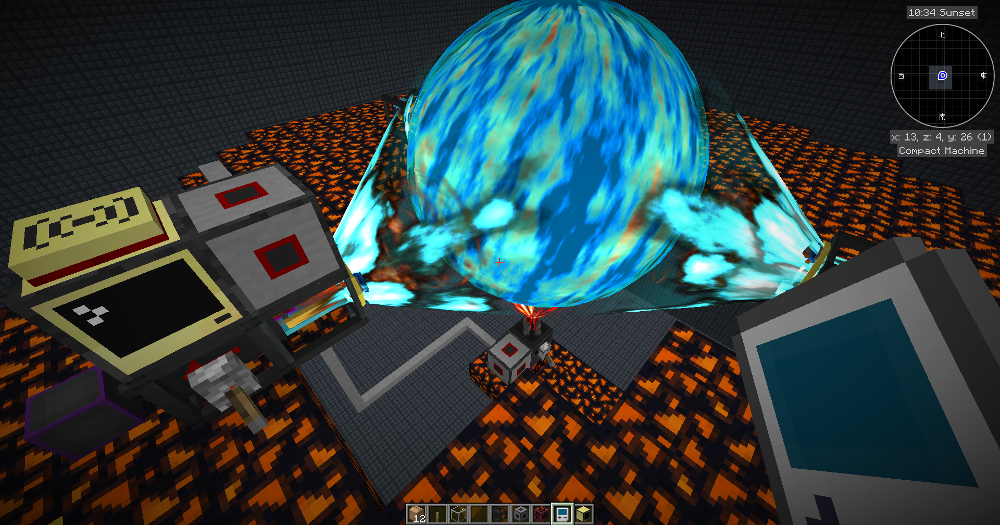

# ATM10-cc-tweaked-Draconic-Evolition-Reactor-Monitoring-System
日本語での説明についてはreadme_jp.txtをお読みください。

Graphical monitoring system for the Draconic Evolution Reactor in ATM10 using CC:Tweaked. 
Provides real‑time status, behavior prediction, and safe/aggressive output recommendations. 
Version 1 includes monitoring only; control features will be released as an optional module.

